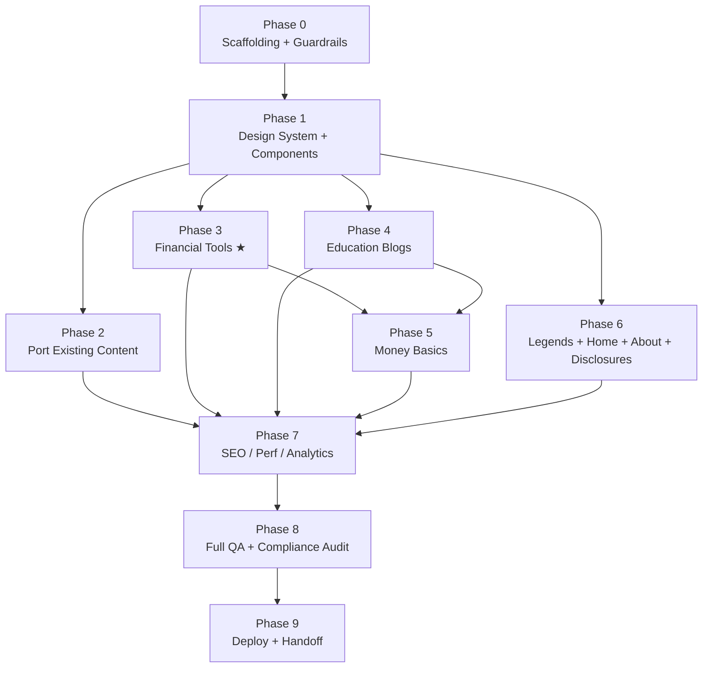

# 23% Club — Production Build Orchestration

**Version:** 3.0 (Orchestration Master)
**Owner:** Saikumar, Founder — 23 Percent Club Pvt Ltd, Hyderabad
**Status:** Pre-build. Repo contains this contract only.
**Purpose of this file:** This README is an **executable build contract**. An LLM CLI agent (Claude Code or equivalent) reads it top to bottom and runs it phase by phase. Every phase declares its dependencies, inputs, exact steps, file manifest, tests, gate, and rollback. Nothing here is aspirational — if it is written as a step, it is meant to be executed.

**Brand line:** *"We don't manage your money. We teach you how to manage it."*
**Tagline:** *Learn · Invest · Grow · Compound.*
**Compliance posture:** Pre-RIA. Every page, every tool, every blog post is **financial education**, never personalised advice. No buy/sell/target-price language. No portfolio review formats. No affiliate income from brokers/AMCs.

---

## Table of Contents

| § | Section | Read when |
|---|---|---|
| [0](#0-agent-operating-manual) | Agent Operating Manual | Before writing any code |
| [1](#1-project-overview) | Project Overview | Before writing any code |
| [2](#2-tech-stack) | Tech Stack | Phase 0 |
| [3](#3-design-system--sapphire-blue) | Design System — Sapphire Blue | Phases 0–1 |
| [4](#4-information-architecture) | Information Architecture & Route Table | Phases 1–6 |
| [5](#5-feature-module-specs) | Feature Module Specs | Phases 3–6 |
| [6](#6-data-contracts) | Data Contracts (TypeScript) | Phases 2–6 |
| [7](#7-orchestration-graph) | Orchestration Graph (the DAG) | Before Phase 0 |
| [8](#8-phase-playbooks) | Phase Playbooks 0→9 | Every phase |
| [9](#9-quality-gates--automated-enforcement) | Quality Gates & Enforcement | Phase 0 sets up, all phases obey |
| [10](#10-testing-strategy) | Testing Strategy | Phase 3 onward |
| [11](#11-content-operating-system) | Content Operating System | Phases 4–6 |
| [12](#12-risk-register) | Risk Register | On any blocker |
| [13](#13-environment--secrets) | Environment & Secrets | Phases 0, 8 |
| [14](#14-target-folder-structure) | Target Folder Structure | Reference |
| [15](#15-open-decisions) | Open Decisions | On ambiguity |
| [16](#16-appendix) | Appendix — command cheat sheet, master DoD | Reference |

---

## 0. Agent Operating Manual

### 0.1 Execution contract

1. **Read the whole file before writing any code.** No exceptions.
2. **Execute phases in DAG order** (§7). A phase may not begin until every phase it depends on has a ✅ in `BUILD-STATE.md`.
3. **Each phase ends at a Gate.** The Gate is a runnable command plus a checklist. If the command fails, the phase is not done — fix, re-run, do not advance.
4. **Never invent financial data**, return figures, statistics, tax rates, or quotes. If a number is needed and not present in `/src/content/data/` or a cited source, write `[VERIFY: source needed]` in the copy and add a row to `VERIFY-QUEUE.md`. Never guess.
5. **Commit at every phase boundary** using the protocol in §0.5.
6. **On ambiguity, follow the stated default** in this file rather than pausing. Only the items in §15 escalate to the founder.
7. **Update `BUILD-STATE.md` after every phase** — it is the resumption point if the session dies mid-build.
8. **Update this README in the same commit** as any architectural change, so the contract never drifts from what shipped.

### 0.2 Orchestration model — who does what

The build runs as a single orchestrator (the main agent) that delegates to specialist passes. Each phase names its **Lead** and its **Skills**.

| Role | Invoked as | Owns |
|---|---|---|
| **Orchestrator** | main agent | Reads the DAG, sequences phases, enforces Gates, writes `BUILD-STATE.md`, commits |
| **Design Lead** | `frontend-design` skill (installed: `frontend-design@claude-plugins-official`) | §3 tokens, all component visuals, page composition, motion, copy voice. Invoke **before** writing any component or page markup — plan tokens/type/layout/signature first, then build |
| **Data Viz Lead** | `dataviz` skill | Every calculator chart, every stat tile, axis/legend/tooltip rules, light+dark palette validation |
| **Compute Lead** | main agent | `src/lib/calculators.ts` — pure functions only, no React, no formatting, 100% unit-tested |
| **Content Lead** | main agent + §11 pipeline | MDX authoring, frontmatter validity, citation discipline, `VERIFY-QUEUE.md` |
| **Compliance Officer** | `scripts/compliance-check.ts` (automated, §9.2) | The SEBI footer on every page, no advice-language anywhere, no unsourced numbers |
| **Reviewer** | `/code-review` skill | Runs at Gates 3, 7, 8 on the phase diff before the commit |

**Delegation rule:** do not spawn subagents for work the orchestrator can do inline. Delegate only when a phase says so explicitly (Phases 2 and 4 have parallelisable fan-out).

### 0.3 State tracking — `BUILD-STATE.md`

Create this file in Phase 0 and update it at every Gate. It is the single resumption point.

```markdown
# BUILD-STATE
Last updated: <ISO date> by <agent/session>
Current phase: <N>
Branch: <branch name>

| Phase | Name | Status | Gate passed | Commit |
|---|---|---|---|---|
| 0 | Scaffolding        | ✅ / 🟡 / ⬜ | <date> | <sha> |
| 1 | Design System      | ⬜ | | |
| ... | | | | |

## Blockers
- <none | description + which §12 risk it maps to>

## Deviations from README
- <none | what changed, why, and the commit that also updated this README>
```

Legend: ⬜ not started · 🟡 in progress · ✅ gate passed · 🔴 blocked.

Also create `VERIFY-QUEUE.md` in Phase 0:

```markdown
# VERIFY QUEUE — numbers and claims needing a primary source
| # | File | Line | Claim | Suggested source | Status |
|---|---|---|---|---|---|
```

Nothing ships to production (Phase 9) with an open row in this table on a live page.

### 0.4 Guardrails — always / never

**Always**
- Render the SEBI disclaimer (§5.7) in the global footer on **every** route, and again directly under **every** calculator result.
- Keep calculator math in pure functions with unit tests before wiring any UI.
- Cite a source inline for any specific number, date, rate, or quote.
- Ship keyboard focus states, `prefers-reduced-motion` support, and mobile layout on every component. Non-negotiable quality floor.
- Preserve existing verified content 1:1 when porting (§5.5). Rendering layer changes; content does not.

**Never**
- Recommend a fund, AMC, stock, broker, or product — anywhere, including blog copy and chart labels.
- Use "buy", "sell", "target price", "should invest", "we recommend", "guaranteed", "assured returns", or portfolio-review framing.
- Present an assumed return as a promise. Assumption language is mandatory next to every projected number.
- Take affiliate links or referral income from brokers/AMCs.
- Skip a Gate to make progress look faster.

### 0.5 Git protocol

- Branch per phase: `phase/<N>-<slug>` (e.g. `phase/3-financial-tools`), cut from `main`.
- Commit message format: `phase(N): <what shipped>` — imperative, one line, plus a body listing the Gate result.
- One PR per phase into `main`. CI (§9.1) must be green. Squash-merge.
- Tag `main` at each Gate: `git tag phase-<N>-done`.
- Never commit `.env*`, `.DS_Store`, `node_modules`, or `.next`. Phase 0 writes the `.gitignore`.

### 0.6 Escalation protocol

| Situation | Action |
|---|---|
| A number/statistic is needed and not sourced | Insert `[VERIFY: source needed]`, log to `VERIFY-QUEUE.md`, continue |
| Two sections of this README conflict | The later section wins; note the conflict in `BUILD-STATE.md` → Deviations; fix the README in the same commit |
| A Gate fails three times on the same cause | Mark phase 🔴 in `BUILD-STATE.md`, write the failing output verbatim, stop that track, continue any parallel track that does not depend on it |
| A decision listed in §15 comes up | Apply the stated default, flag it in `BUILD-STATE.md` for founder review — do not block |
| Anything that would breach §0.4 "Never" | Stop. Do not ship it. Escalate to the founder. |

---

## 1. Project Overview

23% Club is a financial education and behavioural-investing platform for Indian retail investors. The product is a **content + tools website**: it teaches SIP discipline, compounding, and long-term wealth building through calculators, structured education content, and storytelling (Investing Legends). It does not manage money and does not give personalised advice.

**Primary audience:** Indian retail investors, 22–40, early-to-mid career, first-time or undisciplined investors who exit SIPs at breakeven, chase F&O, or don't understand compounding.

**Core user jobs-to-be-done → the module that serves it:**

| The user says | Module | Route |
|---|---|---|
| "Show me what my SIP will actually be worth" | Financial Tools | `/tools/*` |
| "Teach me the thing nobody explained to me" | Education content | `/learn/*` |
| "Make discipline feel earned, not preachy" | Investing Legends | `/legends/*` |
| "Help me untangle loans/cards/tax/insurance without selling me a product" | Money Basics | `/learn/money-basics/*` |
| "What's the market doing right now" | Market | `/market` |

**What "done" means for v1 (product-level, not phase-level):** a visitor can land on any calculator from search, get a correct answer in under 10 seconds on a mid-range Android phone, read the assumption and the disclaimer without scrolling past the result, and click into one blog post that explains why the number behaves that way.

---

## 2. Tech Stack

The current site is static HTML/CSS/JS with a shared `data.js`. That was right for a fast MVP. For production — blogs that need to scale, calculators that need to stay maintainable, and SEO that needs to compete with 1% Club / Groww / ET Money content — upgrade to a framework. The recommendation is deliberately boring and proven, not trendy.

| Layer | Choice | Pin | Why |
|---|---|---|---|
| Framework | **Next.js (App Router, TypeScript)** | `^14` | SSR/SSG for SEO on blog + tool pages, file-based routing matches the existing IA cleanly, huge ecosystem, deploys free-tier friendly |
| Language | **TypeScript** `strict: true` | `^5` | Calculator math and 68-product data both benefit from types; strict mode is not optional |
| Styling | **Tailwind CSS** + CSS variables for the Sapphire Blue tokens | `^3` | Fast to build, keeps design-system variables portable, avoids one-off CSS drift across 60+ pages |
| Content | **MDX** in-repo (`src/content/**`) | `gray-matter` for frontmatter, `next-mdx-remote/rsc` to compile MDX strings from `src/content/*` into React elements by slug (the content-collection pattern this README specifies — separate from `@next/mdx`'s page-route mechanism, which doesn't fit a dynamic `[slug]` route reading a data directory) | Zero infra cost initially; clean upgrade path to a headless CMS |
| Calculators | Client-side TypeScript pure functions, unit-tested — **no server round-trip** | — | SIP/lumpsum/step-up/inflation math is deterministic. Instant results, no backend cost, works offline |
| Charts | **Recharts** | `^2` | Lighter than D3, good enough for calculator output, themes cleanly with Tailwind tokens |
| Market data | **TradingView embeddable widgets** (already integrated in `market.html`) | — | Carry over as-is, already working |
| Search | **fuse.js** client-side fuzzy search for the 68-product database | `^7` | Matches current UX, no search server needed at this scale |
| Forms | **React Hook Form** + Next.js API route → Google Sheets webhook | `^7` | Cheap, no vendor lock-in pre-revenue |
| Testing | **Vitest** (unit) + **Playwright** (e2e/a11y smoke) | latest | Vitest is faster than Jest and needs no Babel config with the Next/TS setup |
| Hosting | **Vercel** free tier | — | Native Next.js support, preview deployments per PR, zero DevOps |
| Analytics | **Plausible** (preferred) or GA4 | — | No cookie banner, privacy-friendly, matches an education brand's trust posture |
| CI | GitHub Actions | — | lint + typecheck + test + build + compliance-check on every PR |

**Migration path from the current static site:** Phase 2 treats the existing static pages (Ecosystem, Universe, Roadmap, Products, Instruments, Mindmaps, market.html) as **content to port**, not to rebuild. Preserve all verified data and copy exactly; only the rendering layer changes.

> **Phase 0 pre-flight:** the legacy static site and its `data.js` are not in this repo. Phase 0 Step 1 locates and vendors them into `/legacy/`. If they cannot be located, Phase 2 is 🔴 blocked — every other phase proceeds unaffected (see the DAG, §7).

---

## 3. Design System — Sapphire Blue

**Locked.** Do not deviate from the brand tokens. Before building any component or page, invoke the **`frontend-design`** skill and produce its short plan (palette → type → layout → signature) *for that surface*, then build to the plan. The tokens below are the fixed input to that plan, not a suggestion to re-derive.

The signature move for this brand is the **ECG-heartbeat-into-cross logo mark** and the **Sapphire / Bright-Blue contrast**. Spend restraint everywhere else. Explicitly avoid the generic-SaaS defaults: identical rounded cards, one shadow on everything, tracked-out ALL-CAPS eyebrows, 01/02/03 markers on content that isn't a sequence.

### 3.1 Color tokens

```css
:root {
  --sapphire-blue: #0F52BA;   /* primary */
  --bright-blue:   #00BFFF;   /* accent — CTAs, highlights, active states */
  --ink:           #0A1A2F;   /* body text, near-black-blue, not pure black */
  --white:         #FFFFFF;
  --off-white:     #F7FAFD;   /* section backgrounds, not stark white */
  --slate:         #5C6B7A;   /* secondary text */
  --success-green: #1D9A6C;   /* positive calculator output only — never for return "promises" */
  --alert-amber:   #C77700;   /* compliance disclaimers, risk notes — swatches/borders/background tints only, see below */
  --alert-amber-text: #8F4F00; /* same hue, darkened — use for amber TEXT and amber ICONS on a light background */
  --border:        #E1E8F0;
}
```

Wire these into the Tailwind theme referencing the CSS variables, so class names (`bg-sapphire`, `text-ink`) and raw CSS stay in sync from one source. (On this stack that's Tailwind v4's CSS-first `@theme inline` block in `src/app/globals.css` rather than `tailwind.config.ts` — see `BUILD-STATE.md` → Deviations.)

**Semantic rules**
- `--success-green` appears only on a computed positive delta. It never appears next to a projected/assumed return, because green + a future number reads as a promise.
- `--alert-amber` is reserved for compliance and risk copy. Do not reuse it as a decorative accent. **Use `--alert-amber-text` wherever amber renders as text or an icon fill** — the base value fails WCAG AA contrast for small text (2.96–3.46:1 against off-white/white; 4.5:1 required), caught by the Phase 1 Gate's axe check. Keep `--alert-amber` for swatches, borders, and low-opacity background tints, where a text-contrast requirement doesn't apply.
- `--bright-blue` is the only CTA color. One primary CTA per viewport.

### 3.2 Typography

- Display / headings: **Outfit** (locked)
- Body / UI: **Inter** (locked)
- Numerals in calculator output: Inter with `font-variant-numeric: tabular-nums` — results must not shift width as the user drags a slider.
- **One accent weight only.** Do not bold random phrases mid-sentence (a generic AI tell). Hierarchy comes from size and the Sapphire/Bright-Blue pairing, not scattered bold.
- Load both faces via `next/font` (self-hosted, `display: swap`) — no render-blocking external font request.

### 3.3 Layout & motion principles

- Left-aligned. Body/blog line length capped under ~75 characters.
- Numbered steps earn numbering only when genuinely sequential: the Roadmap's 17 steps and a calculator's "how it works" do. The 68-product grid and blog cards do **not**.
- **One signature motion moment per page** (e.g. the calculator result animating in), not hover-fade on every card. All motion respects `prefers-reduced-motion`.
- Calculators are the hero interaction of the site. The input+result panel is the most crafted UI element in the repo; everything around it stays quiet.

### 3.4 Chart rules (delegate to `dataviz`)

Every chart in the build follows the `dataviz` skill: form heuristic first, then the color formula, then marks, then interaction. Locked overrides for this brand:
- Growth area charts fill Sapphire at low opacity with a Bright-Blue stroke.
- Y-axis is always labelled in ₹ with Indian digit grouping (lakh/crore), never abbreviated to "K/M".
- Every chart has a text summary of its headline number adjacent to it — the chart is never the only way to get the answer (accessibility + it is the number people screenshot).

---

## 4. Information Architecture

```
23percentclub.com
│
├── / (Home) — hero, mission line, 3-pillar nav (Tools / Learn / Legends), latest post
│
├── /tools  (Financial Tools hub — NEW)
│   ├── /tools/sip-calculator
│   ├── /tools/step-up-sip-calculator
│   ├── /tools/lumpsum-calculator
│   ├── /tools/inflation-calculator
│   └── /tools (index — cards linking to each, "why these numbers matter" framing)
│
├── /learn  (Education hub — restructured)
│   ├── /learn/blog                      (Education Blogs — NEW, paginated)
│   │   └── /learn/blog/[slug]
│   ├── /learn/money-basics              (NEW umbrella for the 5 topics below)
│   │   ├── /learn/money-basics/loans
│   │   ├── /learn/money-basics/credit-cards
│   │   ├── /learn/money-basics/debt
│   │   ├── /learn/money-basics/taxes
│   │   └── /learn/money-basics/insurance
│   ├── /learn/ecosystem                 (existing — Financial Ecosystem)
│   ├── /learn/universe                  (existing — 12 asset classes)
│   ├── /learn/roadmap                   (existing — 17-step lifecycle)
│   ├── /learn/products                  (existing — 68 products, search/filter/compare)
│   ├── /learn/instruments               (existing — 6 families, 27 instruments)
│   └── /learn/mindmaps                  (existing — 8 interactive SVGs)
│
├── /legends  (Investing Legends — standalone pillar, NEW as a hub)
│   ├── /legends/benjamin-graham
│   ├── /legends/peter-lynch
│   ├── /legends/charlie-munger          (episode 3, in progress — stub, status: draft)
│   └── /legends (index — "Legend Stories, Taught Like a Teacher Would")
│
├── /market  (existing — live TradingView data, carry over as-is)
├── /about   (Founder story, IIT Madras + NISM path, mission, team)
└── /disclosures (SEBI disclaimer, methodology notes for every calculator, data sources)
```

### 4.1 Route table — build order and ownership

| Route | Render | Phase | Data source | Notes |
|---|---|---|---|---|
| `/` | SSG | 6 | `content/data`, latest MDX | Built last so it can link to everything real |
| `/tools` | SSG | 3 | static | Index cards |
| `/tools/[calculator]` ×4 | SSG + client compute | 3 | user input only | Hero interaction |
| `/learn` | SSG | 6 | static | Hub index |
| `/learn/blog` | SSG, paginated 12/page | 4 | `content/blog/*.mdx` | Category filter |
| `/learn/blog/[slug]` | SSG | 4 | MDX | `generateStaticParams` |
| `/learn/money-basics` + 5 topics | SSG | 5 | `content/money-basics/*.mdx` | Explainer hubs |
| `/learn/ecosystem` `universe` `roadmap` `products` `instruments` `mindmaps` | SSG | 2 | `content/data/*.ts` | 1:1 port |
| `/legends` + `[slug]` | SSG | 6 | `content/legends/*.mdx` | Munger = draft stub |
| `/market` | Client (widgets) | 2 | TradingView | Re-skin only |
| `/about` `/disclosures` | SSG | 6 | static | `/disclosures` holds every calculator methodology note |
| `/dev/components` | SSG, `noindex` | 1 | sample data | Internal component gallery |

Every route is statically generated unless it is listed as client. There is no database and no server-rendered user state in v1.

**Nav bar (all pages):** `Tools | Learn | Legends | Market | About` — Bright Blue active-state underline, Sapphire Blue base. Footer repeats the SEBI disclaimer on every single page (§5.7), not just tool pages.

---

## 5. Feature Module Specs

### 5.1 Financial Tools (new — highest priority)

All four calculators share one computation engine (`src/lib/calculators.ts`) and one UI shell (`<CalculatorLayout>`) so behaviour, formatting, and disclaimers stay consistent. Compute is pure and separate from render — the engine ships and passes tests *before* any calculator page exists.

**a) SIP Calculator** — `/tools/sip-calculator`
- Inputs: Monthly investment (₹), expected annual return (%, default 12%, user-editable, noted as illustrative not promised), investment duration (years).
- Formula: `FV = P × [((1 + r/12)^n − 1) / (r/12)] × (1 + r/12)` where P = monthly SIP, r = annual rate, n = months.
- Output: Total invested, estimated wealth gained, maturity value, year-by-year growth chart (Recharts area chart, Sapphire fill).
- Compliance line directly under the result: *"Assumed return is illustrative only, not a promise or guarantee."*

**b) Step-up SIP Calculator** — `/tools/step-up-sip-calculator`
- Inputs: Starting monthly SIP, annual step-up % (e.g. 10% increase every year), expected return %, duration.
- Formula: iterative year-by-year FV compounding where the monthly contribution increases by the step-up % at the start of each year.
- Output: Same as SIP + a comparison line showing **flat SIP vs step-up SIP** final value difference — the single most persuasive number for the discipline narrative. This comparison is the page's signature element.

**c) Lumpsum Calculator** — `/tools/lumpsum-calculator`
- Inputs: One-time investment (₹), expected annual return (%), duration (years).
- Formula: `FV = P × (1 + r)^n`
- Output: Maturity value, wealth gained, growth chart.

**d) Inflation Calculator** — `/tools/inflation-calculator`
- Inputs: Current amount (₹), expected inflation rate (%, default 6%), number of years.
- Formula: `Future cost = P × (1 + i)^n`; also show **real value erosion**: `Real value = P / (1 + i)^n`.
- Output: "What ₹X today will feel like in Y years" — framed to justify why returns need to beat inflation; links back to the SIP calculator.

**Shared requirements across all four**
- Every result panel has a **"How this is calculated"** expandable showing the formula and the inputs substituted in — transparency builds trust and is a compliance safeguard (nothing is a black box). The same methodology text is mirrored on `/disclosures`.
- No tool ever recommends a fund, AMC, or product. Output is purely arithmetic on user-entered assumptions.
- Mobile-first: paired slider + numeric input, both editable, both driving one state value.
- Results update on input with a debounce (~120ms) and animate once (§3.3), not on every keystroke frame.
- Indian currency formatting throughout: `₹1,23,45,678` (lakh/crore grouping), via `src/lib/formatters.ts` — never `Intl` default US grouping.
- Each calculator page ends with a contextual CTA into a related blog post (e.g. SIP calculator → "Why most investors stop their SIP at the worst possible time"). Until Phase 4 ships that post, the CTA points at `/learn/blog` and is marked `TODO(phase-4)`.
- Inputs are clamped and validated: no negative values, duration 1–50 years, return −20%–50%, and the UI states the clamp rather than silently correcting.

### 5.2 Education Blogs (`/learn/blog`)
- MDX-based. Frontmatter contract in §6.3.
- Categories map directly to the locked 7-day content rotation (§11): Behavioural Finance, Case Studies, Founder Journey, Wealth Frameworks, Contrarian, Personal Stories, Flagship.
- Company Case Study posts must never use "investment thesis" language — enforced by `scripts/compliance-check.ts` (§9.2), not by good intentions.
- Every post carries the pre-posting filter as an internal-only comment in the template (not shown to readers): `{/* Could another finance creator publish this word-for-word? If yes, don't post it. */}`
- Index paginates 12 per page; category filter is a URL param (`/learn/blog?category=behavioural-finance`) so filtered views are linkable and indexable.

### 5.3 Money Basics (`/learn/money-basics/*`)
Five sub-topics: **Loans, Credit Cards, Debt, Taxes, Insurance.**
- Structured as **explainer hub pages**, not product comparison pages — this avoids the portfolio-review / advice-adjacent trap.
- Fixed page structure for all five: What it is → How it actually works in India → Common mistakes → A worked example with real (cited) numbers → Related tools and blog links.
- The tax page must reflect current rules precisely — e.g. debt mutual funds purchased after April 2023 taxed at slab rate under Section 50AA, not old 3-year LTCG/indexation. **Every rate, threshold, and section number on this page goes through `VERIFY-QUEUE.md` before the page can ship.**
- The insurance page distinguishes term vs investment-linked plans conceptually — education framing only, never "buy this policy."

### 5.4 Investing Legends (`/legends`)
- Each legend gets a long-form narrative page: life context → the defining investing lesson → the sharper, less-obvious version of that lesson (per the founder's principle: prefer the harder truth over the simple narrative) → how an Indian retail investor applies it today.
- Graham and Lynch content already exists — port and re-theme, do not rewrite.
- Munger (Episode 3) is next to be authored; ship `/legends/charlie-munger` as a stub with `status: draft` frontmatter. Draft pages render a "in progress" state, are excluded from the index grid and from the sitemap, and carry `noindex`.
- Every legend page cites sources for any specific number or quote. Unverified quotes are framed as "often attributed to," never asserted as fact.

### 5.5 Existing Modules — port, don't rebuild
Ecosystem, Universe (12 asset classes), Roadmap (17 steps), Products (68, search/filter/compare), Instruments (6 families / 27), Mindmaps (8 SVGs) — migrate content 1:1 from the legacy `data.js` into typed modules under `src/content/data/`. **No content rewrites in this phase**; only the rendering layer changes. Phase 2's Gate includes a diff-count check proving record counts match the source exactly.

### 5.6 Market Data (`/market`)
Carry over the TradingView embeds as-is. No functional change — re-skin inside the new nav shell. Widgets load client-side and lazily (below-fold widgets mount on intersection) so they do not drag the page's LCP.

### 5.7 SEBI Disclaimer (non-negotiable, site-wide)
The `<Footer>` component on **every** page, and a `<ComplianceNote>` directly under **every** calculator result:

> *Educational content only. Not investment advice. Please consult a SEBI-registered investment adviser before making investment decisions.*

This string lives in exactly one place — `src/lib/compliance.ts` as `SEBI_DISCLAIMER` — and is imported everywhere. It is never retyped inline, so it can never drift. `scripts/compliance-check.ts` fails the build if any rendered route omits it.

---

## 6. Data Contracts

Define these in Phase 1 (`src/lib/types.ts`) before Phase 2 fills them. Types come first; data conforms to types, not the reverse.

### 6.1 Calculator engine signatures (`src/lib/calculators.ts`)

```ts
export interface SipInput   { monthlyAmount: number; annualReturnPct: number; years: number }
export interface StepUpInput extends SipInput { annualStepUpPct: number }
export interface LumpsumInput { principal: number; annualReturnPct: number; years: number }
export interface InflationInput { currentAmount: number; inflationPct: number; years: number }

export interface YearPoint {
  year: number;          // 1..n
  invested: number;      // cumulative contributions to date
  value: number;         // portfolio value at end of year
  gain: number;          // value - invested
}

export interface ProjectionResult {
  totalInvested: number;
  maturityValue: number;
  wealthGained: number;
  series: YearPoint[];   // always length === years, always ascending
}

export interface StepUpResult extends ProjectionResult {
  flatComparison: ProjectionResult;   // same inputs with annualStepUpPct = 0
  advantage: number;                  // maturityValue - flatComparison.maturityValue
}

export interface InflationResult {
  futureCost: number;      // what today's basket costs later
  realValue: number;       // what today's money is worth later
  erosionPct: number;      // (currentAmount - realValue) / currentAmount * 100
  series: YearPoint[];
}

export function calculateSip(input: SipInput): ProjectionResult
export function calculateStepUpSip(input: StepUpInput): StepUpResult
export function calculateLumpsum(input: LumpsumInput): ProjectionResult
export function calculateInflation(input: InflationInput): InflationResult
```

**Engine rules:** no rounding inside the engine (callers format); no `Intl`, no React, no DOM; every function total for its clamped input domain; `years = 0` returns a zero result rather than throwing.

### 6.2 Content data modules (`src/content/data/*.ts`)

```ts
export interface Product {
  id: string; name: string; category: string; subCategory?: string;
  riskLevel: 'low' | 'moderate' | 'high' | 'very-high';
  liquidity: string; taxation: string; minInvestment?: string;
  description: string; suitableFor: string[];   // education framing, not a recommendation
  source?: string;                              // citation for any hard number
}

export interface AssetClass { id: string; name: string; summary: string; characteristics: string[]; examples: string[] }
export interface RoadmapStep { order: number; title: string; body: string; relatedTools?: string[] }
export interface Instrument { id: string; family: string; name: string; description: string; keyFacts: string[] }
export interface MindMap { id: string; title: string; svgPath: string; nodes: { id: string; label: string; detail: string }[] }
```

Counts are contractual: **68** products, **12** asset classes, **17** roadmap steps, **6** instrument families / **27** instruments, **8** mindmaps. Phase 2's Gate asserts these counts in a test.

### 6.3 MDX frontmatter contracts

```yaml
# src/content/blog/*.mdx
title: string          # required
slug: string           # required, kebab-case, must match filename
date: YYYY-MM-DD       # required
category: enum         # one of the 7 rotation categories (§11)
readTime: number       # minutes, integer
author: string
coverImage: string     # /public path
excerpt: string        # <= 200 chars, used for meta description + cards
status: published | draft   # default published
sources: string[]      # required if the post states any figure
```

```yaml
# src/content/legends/*.mdx
name: string
slug: string
era: string
oneLineLesson: string
status: published | draft
sources: string[]      # required
coverImage: string
```

Frontmatter is parsed with `gray-matter` and **validated at build time** by `scripts/validate-content.ts` — a malformed or missing required field fails the build, it does not render a broken card.

---

## 7. Orchestration Graph

### 7.1 The DAG



★ = critical path. Phase 3 is the product's reason to exist; if time is short, everything else waits on it.

### 7.2 Dependency and parallelism table

| Phase | Name | Depends on | Can run in parallel with | Lead | Skills |
|---|---|---|---|---|---|
| 0 | Scaffolding & Guardrails | — | — | Orchestrator | — |
| 1 | Design System & Components | 0 | — | Design Lead | `frontend-design` |
| 2 | Port Existing Content | 1 | 3, 4 | Orchestrator | — |
| 3 | **Financial Tools** ★ | 1 | 2, 4 | Compute Lead → Design Lead | `dataviz`, `frontend-design` |
| 4 | Education Blogs | 1 | 2, 3 | Content Lead | `frontend-design` |
| 5 | Money Basics | 3, 4 | 6 | Content Lead | — |
| 6 | Legends, Home, About, Disclosures | 1 (content), 3+4+5 (for real links) | 5 | Content + Design Lead | `frontend-design` |
| 7 | SEO, Performance, Analytics | 2,3,4,5,6 | — | Orchestrator | — |
| 8 | Full QA & Compliance Audit | 7 | — | Reviewer + Compliance | `/code-review` |
| 9 | Deploy & Handoff | 8 | — | Orchestrator | — |

**Recommended execution lanes** (if running more than one track): after Gate 1 passes, run **Lane A = Phase 3** (critical path) and **Lane B = Phase 2 → Phase 4** concurrently on separate branches. They touch disjoint directories (`src/app/tools` + `src/lib` vs `src/app/learn` + `src/content`) so merge conflicts are limited to `src/lib/types.ts` — which Phase 1 froze.

### 7.3 Gate summary

| Gate | Passes when | Command |
|---|---|---|
| G0 | Blank scaffold builds with tokens visible | `npm run verify` |
| G1 | `/dev/components` renders every shared component | `npm run verify && npm run test:a11y` |
| G2 | All 6 ported pages match source record counts | `npm run verify && npm run test -- content-parity` |
| G3 | Calculator math correct, disclaimers present | `npm run verify && npm run test -- calculators` |
| G4 | Blog index + slug pages render with valid metadata | `npm run verify && npm run validate:content` |
| G5 | 5 Money Basics pages live, cross-linked, zero open VERIFY rows | `npm run verify && npm run compliance` |
| G6 | Legends + Home + About + Disclosures live | `npm run verify && npm run compliance` |
| G7 | Lighthouse ≥ 90 ×4 on the 5 key page types | `npm run lighthouse` |
| G8 | Zero compliance violations, zero broken links, clean review | `npm run audit:full` |
| G9 | Production URL live, founder can publish a post via PR | manual + `npm run audit:full` against prod |

---

## 8. Phase Playbooks

Each playbook has the same shape: **Purpose · Depends on · Lead & Skills · Inputs · Steps · Files created · Tests · Gate · Rollback · Commit.** Do not improvise a different shape.

---

### Phase 0 — Scaffolding & Guardrails

**Purpose:** Stand up a repo where the guardrails exist *before* the first feature, so nothing can ship non-compliant.
**Depends on:** nothing. **Lead:** Orchestrator. **Skills:** none.
**Inputs:** §2 stack table, §3.1 tokens, §13 env list.

**Steps**
1. **Pre-flight — locate the legacy site.** Find the existing static build (`index.html`, `data.js`, `market.html`, the 8 mindmap SVGs, logo assets). Copy it into `/legacy/` at the repo root and commit it untouched as the porting source of truth. If it cannot be located, record a 🔴 on Phase 2 in `BUILD-STATE.md` and continue — no other phase depends on it.
2. `npx create-next-app@latest . --typescript --tailwind --app --src-dir --eslint --import-alias "@/*"`
3. Install runtime deps: `npm i recharts fuse.js react-hook-form @next/mdx @mdx-js/react gray-matter zod`
4. Install dev deps: `npm i -D vitest @vitejs/plugin-react @testing-library/react jsdom @playwright/test @axe-core/playwright prettier`
5. Wire §3.1 tokens: write them as CSS variables in `src/app/globals.css`, then map them in `tailwind.config.ts` under `theme.extend.colors` so both class names and raw CSS read one source.
6. Load Outfit + Inter via `next/font` in the root layout; set `tabular-nums` as a utility class for numeric output.
7. Set `tsconfig.json` → `"strict": true`, `"noUncheckedIndexedAccess": true`.
8. Write the npm scripts block (§16.1) — `verify`, `test`, `compliance`, `validate:content`, `lighthouse`, `audit:full`.
9. Write `scripts/compliance-check.ts` and `scripts/validate-content.ts` as working stubs that exit 0 on an empty site but contain the real rule lists from §9.2 — they get teeth as content arrives.
10. Write `src/lib/compliance.ts` exporting `SEBI_DISCLAIMER` and the banned-phrase list.
11. Create `BUILD-STATE.md`, `VERIFY-QUEUE.md`, `.gitignore`, `.env.example`, `.github/workflows/ci.yml` (§9.1).
12. Placeholder home page proving the tokens render: Sapphire heading, Bright-Blue CTA, Inter body, and the `<Footer>` disclaimer.

**Files created**
```
package.json  tsconfig.json  tailwind.config.ts  next.config.mjs  vitest.config.ts  playwright.config.ts
.gitignore  .env.example  .github/workflows/ci.yml
BUILD-STATE.md  VERIFY-QUEUE.md
src/app/layout.tsx  src/app/page.tsx  src/app/globals.css
src/lib/compliance.ts
scripts/compliance-check.ts  scripts/validate-content.ts
legacy/**  (vendored, untouched)
```

**Tests:** none yet — the harness must run and report zero tests without erroring.
**Gate G0:** `npm run verify` (lint + typecheck + build) exits 0. The placeholder page shows all nine tokens and the SEBI footer. CI is green on a throwaway PR.
**Rollback:** delete the working tree and re-scaffold; nothing downstream exists yet.
**Commit:** `phase(0): scaffold Next.js + Tailwind with Sapphire tokens, CI, and compliance guardrails`

---

### Phase 1 — Design System & Shared Components

**Purpose:** Build the component vocabulary once so no page invents its own. This is the phase that decides whether the site looks designed or templated.
**Depends on:** 0. **Lead:** Design Lead. **Skills:** `frontend-design` (mandatory, invoke before writing markup), `dataviz` (for the chart shell only).
**Inputs:** §3 in full, §4.1 route table, §6.1 types.

**Steps**
1. **Invoke `frontend-design`.** Produce the compact plan for the site shell: palette (the §3.1 tokens, already fixed), type roles (Outfit display / Inter body / Inter tabular for data), layout concept, and the **signature** — the ECG-heartbeat-into-cross mark and its one motion moment. Critique the plan against the generic-default checklist before writing a line of JSX.
2. Freeze `src/lib/types.ts` from §6.1 and §6.2 — every later phase imports from here, so it changes only by explicit README amendment.
3. Build the logo as SVG React components: icon mark, horizontal wordmark, stacked square. Static SVG, no runtime library.
4. Build the shell: `<Navbar>` (Tools | Learn | Legends | Market | About, Bright-Blue active underline), `<Footer>` (imports `SEBI_DISCLAIMER`), `<Container>`, `<Section>`.
5. Build the primitives: `<Button>` (one primary variant in Bright Blue, one quiet secondary), `<Card>` — and resist making every card identical; the product card, blog card, and legend card differ because their content differs.
6. Build `<CalculatorLayout>`: input panel (slot), result panel (slot), `<HowThisIsCalculated>` expandable, `<ComplianceNote>`. This is the most crafted element in the repo (§3.3) — treat it that way.
7. Build `<GrowthChart>` per `dataviz`: Sapphire area fill, Bright-Blue stroke, ₹ lakh/crore axis labels, adjacent text summary of the headline number, tooltip rules, reduced-motion path.
8. Build `<BlogCard>`, `<LegendCard>`, `<ProductCard>`, `<Pagination>`, `<CategoryFilter>`, `<SourceCitation>`.
9. Write `src/lib/formatters.ts`: `formatINR()` with lakh/crore grouping, `formatPercent()`, `formatYears()`. Unit-test `formatINR` now — it is used by every number on the site.
10. Build `/dev/components` — one page rendering every component with sample data, in every state (default, hover, focus, error, empty, loading). Add `robots: noindex`.

**Files created**
```
src/lib/types.ts  src/lib/formatters.ts
src/components/brand/{LogoMark,LogoHorizontal,LogoStacked}.tsx
src/components/layout/{Navbar,Footer,Container,Section}.tsx
src/components/ui/{Button,Card,Expandable,ComplianceNote,SourceCitation,Pagination,CategoryFilter}.tsx
src/components/calculator/{CalculatorLayout,InputSlider,ResultPanel,HowThisIsCalculated}.tsx
src/components/charts/GrowthChart.tsx
src/components/cards/{BlogCard,LegendCard,ProductCard}.tsx
src/app/dev/components/page.tsx
tests/formatters.test.ts
```

**Tests:** `formatters.test.ts` — ₹0, ₹999, ₹1,00,000, ₹1,23,45,678, negative, fractional.
**Gate G1:** `npm run verify` passes; `/dev/components` renders every component in every state; axe reports zero critical violations on that page; keyboard tab order is visible and sane; the page reads as the Sapphire Blue system with no generic-SaaS-card defaults.
**Rollback:** `git revert` the phase merge — Phase 2+ have not started.
**Commit:** `phase(1): shared component system, calculator shell, chart primitive, dev gallery`

---

### Phase 2 — Port Existing Content

**Purpose:** Move six working pages onto the new stack with **zero content drift**.
**Depends on:** 1. **Parallel with:** 3, 4. **Lead:** Orchestrator. **Skills:** none (this is transcription, not design).
**Inputs:** `/legacy/data.js`, the legacy HTML pages, §5.5, §6.2 types.

**Steps**
1. Read `/legacy/data.js` in full. Do not summarise, do not "improve" copy, do not drop fields.
2. Transcribe into typed modules — one file per dataset, each `as const satisfies Product[]` (etc.) so a type error surfaces the moment a record is malformed:
   `src/content/data/{ecosystem,universe,roadmap,products,instruments,mindmaps}.ts`
3. Write `tests/content-parity.test.ts` asserting the §6.2 counts: 68 / 12 / 17 / 6 families+27 / 8. This test is the anti-drift lock.
4. Rebuild each page as an App Router route reusing Phase 1 components:
   - `/learn/ecosystem`, `/learn/universe`, `/learn/roadmap` (17 steps **do** get numbering — they are a real sequence)
   - `/learn/products` — fuse.js fuzzy search, category + risk filters, compare tray. Search index built at module load, not per keystroke.
   - `/learn/instruments`, `/learn/mindmaps` (SVGs move to `public/mindmaps/`, interaction preserved)
5. `/market` — re-embed the TradingView widgets inside the new nav shell, lazy-mounted below the fold. No functional change.
6. Spot-check three records per dataset against `/legacy/` by eye before the Gate.

**Files created**
```
src/content/data/{ecosystem,universe,roadmap,products,instruments,mindmaps}.ts
src/app/learn/{ecosystem,universe,roadmap,products,instruments,mindmaps}/page.tsx
src/app/market/page.tsx
src/lib/search.ts
public/mindmaps/*.svg
tests/content-parity.test.ts
```

**Tests:** `content-parity.test.ts` (counts + no empty required fields); `search.test.ts` (a known product is findable by partial name and by category).
**Gate G2:** `npm run verify` and `npm run test -- content-parity` pass; all six pages render with content identical to `/legacy/`; Products search, filter, and compare work; `/market` widgets load.
**Rollback:** revert the merge — Phases 3 and 4 are on separate branches and unaffected.
**Commit:** `phase(2): port ecosystem, universe, roadmap, products, instruments, mindmaps, market to Next.js`

---

### Phase 3 — Financial Tools ★ (critical path)

**Purpose:** Ship the four calculators. This is the product.
**Depends on:** 1. **Parallel with:** 2, 4. **Lead:** Compute Lead, then Design Lead. **Skills:** `dataviz`, `frontend-design`.
**Inputs:** §5.1 formulas, §6.1 signatures, Phase 1 `<CalculatorLayout>` + `<GrowthChart>`.

**Steps — compute before UI, always**
1. Write `src/lib/calculators.ts` implementing the four §6.1 signatures exactly. Pure functions. No formatting, no rounding, no React.
2. Write `tests/calculators.test.ts` **before** wiring any page. Required cases per §10.2: known-value spot checks computed by hand, 0% return, 0 years, 50 years, ₹1 input, very large input, negative-return clamp boundary, and `series.length === years` on all four.
3. Run the tests. **Do not proceed to step 4 until they are green.** A wrong number on a finance site is the one bug that costs trust permanently.
4. Write `src/lib/methodology.ts` — one entry per calculator holding the formula string, the plain-English explanation, and the assumption caveat. `<HowThisIsCalculated>` and `/disclosures` both read from it, so they can never disagree.
5. Build `/tools/sip-calculator` using `<CalculatorLayout>`: paired slider+number inputs, debounced compute, `<GrowthChart>`, result tiles (total invested / wealth gained / maturity value), `<HowThisIsCalculated>`, `<ComplianceNote>`.
6. Build `/tools/lumpsum-calculator` and `/tools/inflation-calculator` from the same shell.
7. Build `/tools/step-up-sip-calculator` — plus its signature element: the **flat vs step-up** comparison. Invoke `frontend-design` for this one moment specifically; it is the page's thesis and the most persuasive number on the site.
8. Build `/tools` index: four cards with the "why these numbers matter" framing, no numbering (not a sequence).
9. Add the contextual blog CTA to each calculator, marked `TODO(phase-4)` until the target posts exist.
10. Run `/code-review` on the phase diff before opening the PR.

**Files created**
```
src/lib/calculators.ts  src/lib/methodology.ts
src/app/tools/page.tsx
src/app/tools/{sip-calculator,step-up-sip-calculator,lumpsum-calculator,inflation-calculator}/page.tsx
src/components/calculator/{SipForm,StepUpForm,LumpsumForm,InflationForm,ComparisonCallout}.tsx
tests/calculators.test.ts
tests/e2e/calculators.spec.ts
```

**Tests:** unit per §10.2 (target: 100% branch coverage on `calculators.ts`); Playwright e2e — enter values, assert the on-screen maturity value matches the engine's output, assert the disclaimer is in the DOM under the result.
**Gate G3:** all calculator unit tests green; each calculator spot-checked against a manual computation; the SEBI note renders under every result; sliders and number inputs stay in sync; mobile layout works at 360px; `npm run compliance` finds no banned phrasing on `/tools/*`; `/code-review` findings resolved.
**Rollback:** revert the merge. `src/lib/calculators.ts` is self-contained, so a revert removes the feature cleanly.
**Commit:** `phase(3): four calculators on a shared tested compute engine, with methodology and compliance notes`

---

### Phase 4 — Education Blogs

**Purpose:** Stand up the MDX pipeline and the first batch of posts.
**Depends on:** 1. **Parallel with:** 2, 3. **Lead:** Content Lead. **Skills:** `frontend-design` (post template typography).
**Inputs:** §5.2, §6.3 frontmatter contract, §11 rotation.

**Steps**
1. Configure `@next/mdx` + `gray-matter`. Build `src/lib/content.ts`: `getAllPosts()`, `getPostBySlug()`, `getPostsByCategory()` — all reading the filesystem at build time, all returning typed objects.
2. Give `scripts/validate-content.ts` its teeth: enforce the §6.3 frontmatter contract with `zod`; fail the build on a missing required field, a slug/filename mismatch, an unknown category, or a stated figure with an empty `sources[]`.
3. Build the MDX component map: headings, `<SourceCitation>`, callouts, tables, and a `<CalculatorEmbed>` that links (does not duplicate) a tool.
4. Build `/learn/blog` index — 12 per page, category filter as a URL param, `<BlogCard>` grid (no numbering).
5. Build `/learn/blog/[slug]` with `generateStaticParams` and `generateMetadata` (title, description from `excerpt`, OG image from `coverImage`).
6. Author/migrate the first batch. Start with material already published on LinkedIn/Instagram that fits the education-blog format. **Minimum to pass the Gate: one post per rotation category (7 posts)**, so the filter has something to filter and the categories are proven.
7. Write the posts each calculator's CTA points at, then remove the `TODO(phase-4)` markers from Phase 3.
8. Add the internal-only pre-posting filter comment to the post template.

**Files created**
```
src/lib/content.ts
src/app/learn/blog/page.tsx  src/app/learn/blog/[slug]/page.tsx
src/components/mdx/{MdxComponents,Callout,CalculatorEmbed}.tsx
src/content/blog/*.mdx  (≥7)
scripts/validate-content.ts  (completed)
tests/content-validation.test.ts
```

**Tests:** frontmatter validation rejects a deliberately malformed fixture; `getPostsByCategory` returns only that category; every post's `slug` matches its filename.
**Gate G4:** `npm run verify` and `npm run validate:content` pass; index paginates; category filter works and is linkable; each post renders correct SEO metadata (verify OG tags in the built HTML); all seven categories represented.
**Rollback:** revert the merge; Phase 3's CTA markers return to `TODO(phase-4)`.
**Commit:** `phase(4): MDX blog pipeline, validated frontmatter, index with category filter, first seven posts`

---

### Phase 5 — Money Basics Hub

**Purpose:** Five explainer pages on loans, credit cards, debt, taxes, insurance — education framing only.
**Depends on:** 3 and 4 (pages must cross-link to real tools and real posts). **Parallel with:** 6. **Lead:** Content Lead.
**Inputs:** §5.3 structure, the calculators from Phase 3, the posts from Phase 4.

**Steps**
1. Build `/learn/money-basics` as an umbrella index with the five topic cards.
2. Author each topic as MDX following the fixed structure: What it is → How it actually works in India → Common mistakes → A worked example with cited numbers → Related tools and blog links.
3. **Tax page discipline:** every rate, threshold, slab, and section number gets an inline `<SourceCitation>` to a primary source (Income Tax Act / CBDT / SEBI circular). Anything unsourced becomes `[VERIFY: source needed]` plus a `VERIFY-QUEUE.md` row. Includes the post-April-2023 debt mutual fund slab-rate treatment under Section 50AA.
4. **Insurance page discipline:** distinguish term vs investment-linked conceptually. No product names, no "buy this policy."
5. Cross-link: every topic page links to **at least one calculator and one blog post** — the inflation calculator from the debt page, the SIP calculator from the taxes page, and so on.
6. Run `npm run compliance` and clear every open `VERIFY-QUEUE.md` row that appears on one of these five pages.

**Files created**
```
src/app/learn/money-basics/page.tsx
src/app/learn/money-basics/[topic]/page.tsx
src/content/money-basics/{loans,credit-cards,debt,taxes,insurance}.mdx
```

**Tests:** a link test asserting each of the five pages contains ≥1 `/tools/` link and ≥1 `/learn/blog/` link.
**Gate G5:** all five pages live; cross-link test passes; `npm run compliance` clean; **zero open `VERIFY-QUEUE.md` rows pointing at these pages**; no product or policy is named as a recommendation.
**Rollback:** revert the merge; the umbrella index returns a 404 until re-landed.
**Commit:** `phase(5): money basics hub — loans, credit cards, debt, taxes, insurance with cited sources`

---

### Phase 6 — Legends, Home, About, Disclosures

**Purpose:** The narrative pillar plus the pages that only make sense once everything else is real.
**Depends on:** 1 for components, 3+4+5 for the links Home makes. **Parallel with:** 5. **Lead:** Content + Design Lead. **Skills:** `frontend-design`.
**Inputs:** §5.4, existing Graham and Lynch material, §5.1 methodology entries.

**Steps**
1. Build the legend MDX template per §5.4: life context → defining lesson → the sharper less-obvious version → how an Indian retail investor applies it today.
2. Migrate Graham and Lynch 1:1 into `src/content/legends/`, citations intact. Frame unverified quotes as "often attributed to."
3. Ship `/legends/charlie-munger` as a `status: draft` stub — excluded from the index grid and the sitemap, `noindex`.
4. Build `/legends` index: "Legend Stories, Taught Like a Teacher Would". Published legends only.
5. Build `/` — invoke `frontend-design` for the hero. The hero is a thesis, not a template: open with the most characteristic thing in this brand's world. Then the three-pillar nav (Tools / Learn / Legends) and the latest post. Real links only, no placeholders.
6. Build `/about` — founder story, IIT Madras + NISM path, mission, team.
7. Build `/disclosures` — the SEBI disclaimer in full, **every** calculator's methodology (rendered from `src/lib/methodology.ts`, not retyped), and the data-source list.
8. Build `/learn` as the education hub index tying the blog, money basics, and the six ported modules together.

**Files created**
```
src/app/page.tsx  (replaces the Phase 0 placeholder)
src/app/learn/page.tsx
src/app/legends/page.tsx  src/app/legends/[slug]/page.tsx
src/app/about/page.tsx  src/app/disclosures/page.tsx
src/content/legends/{benjamin-graham,peter-lynch,charlie-munger}.mdx
```

**Tests:** draft-status test — a `status: draft` legend is absent from the index, absent from the sitemap, and carries `noindex`.
**Gate G6:** `/legends` index and both published legend pages render with citations intact; no unverified figures asserted as fact; Home links resolve to real pages; `/disclosures` lists all four methodologies; `npm run compliance` clean.
**Rollback:** revert the merge; restore the Phase 0 placeholder home page.
**Commit:** `phase(6): legends hub, home, about, disclosures`

---

### Phase 7 — SEO, Performance, Analytics

**Purpose:** Make the site findable and fast. Content work stops here; this phase touches configuration and budgets, not copy.
**Depends on:** 2, 3, 4, 5, 6. **Lead:** Orchestrator.

**Steps**
1. `src/app/sitemap.ts` and `src/app/robots.ts` — exclude `/dev/*` and every `status: draft` route.
2. Per-route `generateMetadata`: title, description, canonical, OG image, Twitter card. Defaults in the root layout; every route overrides deliberately.
3. Structured data: `Article` JSON-LD on blog and legend pages, `Organization` on Home, `FAQPage` on Money Basics where the content genuinely is Q&A.
4. Performance: audit bundle size, confirm calculators ship no server code, lazy-load below-fold TradingView widgets and chart components, verify `next/font` self-hosting, set explicit dimensions on every image to kill layout shift.
5. Wire Plausible (default; no cookie banner needed). Track four events only: `calculator_used`, `blog_read_complete`, `tool_cta_clicked`, `newsletter_signup`. No personal data, no third-party ad pixels.
6. Add the Lighthouse CI budget to `.github/workflows/ci.yml` (§9.3) so a regression fails a PR instead of being discovered later.

**Files created**
```
src/app/sitemap.ts  src/app/robots.ts
src/lib/seo.ts  src/lib/analytics.ts
lighthouserc.json
```

**Gate G7:** Lighthouse mobile ≥ 90 on Performance, Accessibility, Best Practices, and SEO for the five key page types — Home, one calculator, one blog post, one legend page, `/learn/products`. Sitemap excludes drafts and `/dev`. Analytics fires on a real interaction.
**Rollback:** revert the merge; the site stays functional, only unoptimised.
**Commit:** `phase(7): sitemap, per-route metadata, JSON-LD, performance budget, Plausible`

---

### Phase 8 — Full QA & Compliance Audit

**Purpose:** The last gate before the public sees it. Assume nothing from earlier phases; verify it.
**Depends on:** 7. **Lead:** Reviewer + Compliance Officer. **Skills:** `/code-review`.

**Steps**
1. `npm run audit:full` — lint, typecheck, unit, e2e, content validation, compliance check, link check, Lighthouse.
2. **Compliance sweep (manual, page by page):** every route has the footer disclaimer; every calculator result has `<ComplianceNote>`; zero banned phrases (§9.2); every figure sourced or `[VERIFY]`-flagged; no fund, AMC, broker, or product recommended anywhere; no affiliate link in the repo.
3. `VERIFY-QUEUE.md` must have **zero open rows on live pages**. Any that remain: either source the number or remove the claim. There is no third option.
4. Accessibility: axe on all page types, keyboard-only pass through a full calculator flow, focus visible everywhere, reduced-motion honoured, chart data reachable as text.
5. Cross-browser and device: Chrome/Safari/Firefox desktop, iOS Safari, Android Chrome. Calculator sliders are the highest-risk element on touch — test them specifically.
6. Link integrity: zero broken internal links, zero console errors on any route.
7. Run `/code-review` across the full diff from `phase-0-done` to HEAD.
8. Content voice pass: no scattered mid-sentence bold, no ALL-CAPS eyebrows on non-sequences, no 01/02/03 markers on unordered content, no "template" hero.

**Gate G8:** `npm run audit:full` exits 0; the compliance sweep checklist is fully ticked; `VERIFY-QUEUE.md` clean; zero critical axe violations; zero broken links; `/code-review` findings resolved or explicitly deferred with a reason in `BUILD-STATE.md`.
**Rollback:** n/a — this phase only finds and fixes.
**Commit:** `phase(8): full QA, accessibility, and compliance audit`

---

### Phase 9 — Deploy & Handoff

**Purpose:** Live site, and a founder who can publish without an engineer.
**Depends on:** 8. **Lead:** Orchestrator.

**Steps**
1. Connect the repo to Vercel; set the §13 env vars in the Vercel dashboard (never in the repo).
2. Deploy `main` to production; connect the custom domain; verify HTTPS and the apex/www redirect.
3. Enable preview deployments per PR so the founder can review content changes visually before merge.
4. Re-run `npm run audit:full` **against the production URL**, not just locally.
5. Write `CONTENT-GUIDE.md` — the handoff document, in plain language, no code required:
   - How to add a blog post (copy the template, fill frontmatter, drop it in `src/content/blog/`, open a PR, check the preview)
   - How to add a legend
   - How to publish a draft (flip `status`)
   - Where the SEBI disclaimer lives and why it must never be retyped inline
   - How to change a calculator's default assumption (e.g. the 12% return) and what else must change with it
   - What `[VERIFY: source needed]` means and how to clear it
6. Submit the sitemap to Google Search Console; confirm indexing on the five key page types.
7. Final `BUILD-STATE.md` update: all phases ✅, production URL recorded, open items listed.

**Files created:** `CONTENT-GUIDE.md`
**Gate G9:** production URL live on the custom domain; `npm run audit:full` passes against production; the founder publishes a test blog post via PR, sees it on the preview deployment, and merges it — **without touching code logic**. That last item is the real definition of done for this build.
**Rollback:** Vercel instant rollback to the previous deployment; `main` stays the source of truth.
**Commit:** `phase(9): production deploy, domain, analytics verification, content handoff guide`

---

## 9. Quality Gates & Automated Enforcement

Compliance that depends on remembering is compliance that fails. Everything in §0.4 that *can* be a script *is* a script.

### 9.1 CI pipeline (`.github/workflows/ci.yml`)

Runs on every PR into `main`, in this order — fail fast, cheapest checks first:

| Step | Command | Fails the PR when |
|---|---|---|
| 1. Lint | `npm run lint` | ESLint error |
| 2. Typecheck | `tsc --noEmit` | Any type error (`strict: true`) |
| 3. Unit tests | `vitest run` | Any failing test; calculator coverage below 100% branch |
| 4. Content validation | `tsx scripts/validate-content.ts` | Invalid or missing MDX frontmatter |
| 5. Build | `next build` | Build error |
| 6. Compliance check | `tsx scripts/compliance-check.ts` | Any §9.2 violation |
| 7. E2E + a11y | `playwright test` | Failing flow or critical axe violation |
| 8. Lighthouse | `lhci autorun` | Any of the four scores below 90 on a key page type |

### 9.2 `scripts/compliance-check.ts` — the rules

Runs against the built output in `.next/server/app/**` so it checks what actually renders, not what the source intends.

```ts
// Rule 1 — Disclaimer presence
//   Every rendered route must contain SEBI_DISCLAIMER verbatim.
// Rule 2 — Calculator result notes
//   Every /tools/* route must contain the illustrative-return caveat.
// Rule 3 — Banned phrases (case-insensitive, word-boundary matched)
const BANNED = [
  'guaranteed return', 'assured return', 'risk-free return',
  'we recommend', 'you should buy', 'you should invest in',
  'target price', 'best fund', 'top fund to buy',
  'investment thesis',        // Case Study posts specifically (§5.2)
  'portfolio review', 'multibagger', 'sure shot',
];
// Rule 4 — Unresolved verification markers
//   No '[VERIFY:' may appear in a published (non-draft) route.
// Rule 5 — Affiliate hygiene
//   No outbound link carrying ref/affiliate/utm_source=partner params.
// Exit non-zero listing file, route, and matched rule for every violation.
```

Rule 3 is intentionally blunt. A false positive is a ten-second rewrite; a false negative is a regulatory problem.

### 9.3 Performance budget (`lighthouserc.json`)

| Metric | Budget | Applies to |
|---|---|---|
| Performance | ≥ 90 (mobile) | Home, one calculator, one blog post, one legend, `/learn/products` |
| Accessibility | ≥ 90 | all of the above |
| Best Practices | ≥ 90 | all of the above |
| SEO | ≥ 90 | all of the above |
| LCP | < 2.5s | Home, calculator |
| CLS | < 0.1 | every page (explicit image dimensions) |
| Total JS (calculator route) | < 180KB gzipped | `/tools/*` |

`/market` is exempt from the JS budget — third-party TradingView widgets dominate it and are out of our control. It is not exempt from the accessibility budget.

---

## 10. Testing Strategy

### 10.1 What gets tested, and how hard

| Layer | Tool | Coverage target | Rationale |
|---|---|---|---|
| Calculator math | Vitest | **100% branch** | A wrong number is the one unrecoverable bug on a finance site |
| Formatters | Vitest | 100% | Every visible number passes through here |
| Content loaders + frontmatter | Vitest | happy path + malformed fixture | A bad post should fail the build, not render broken |
| Data parity (68/12/17/27/8) | Vitest | exact counts | The anti-drift lock on the Phase 2 port |
| Components | Testing Library | smoke + a11y roles | Visual correctness is a human check, not a snapshot check |
| Calculator flows | Playwright | 4 flows | The user-visible number must match the engine's number |
| Accessibility | axe via Playwright | zero critical | Quality floor, not a nice-to-have |
| Compliance | custom script | zero violations | §9.2 |

No visual snapshot tests. They break on every legitimate design change and train the agent to update snapshots reflexively rather than look at the page.

### 10.2 Required calculator test cases (Phase 3 cannot pass without these)

For **each** of the four calculators:
1. **Known-value check** — a hand-computed expected result, asserted to 2 decimal places. Document the manual computation in a comment.
2. `annualReturnPct = 0` → maturity equals total invested exactly (no phantom growth from a divide-by-zero path).
3. `years = 0` → zero result, no throw.
4. `years = 50` → finite, no overflow, `series.length === 50`.
5. Minimum input (₹1 / ₹500) → no rounding collapse to zero.
6. Large input (₹10,00,000/month) → no precision loss in the maturity value.
7. `series` is strictly ascending in `invested` and ends at `maturityValue`.
8. Negative return within the clamp → value declines monotonically, function stays total.

Step-up specific: `annualStepUpPct = 0` must produce a result identical to `calculateSip` with the same inputs — this single assertion proves the two engines agree and makes the flat-vs-step-up comparison trustworthy.

Inflation specific: `futureCost × realValue ≈ currentAmount²` for the same rate and horizon — a cheap invariant that catches an inverted formula.

---

## 11. Content Operating System

### 11.1 The 7-day rotation (locked)

| Day | Category | Slug | Job it does |
|---|---|---|---|
| Mon | Behavioural Finance | `behavioural-finance` | Why people act against their own interest |
| Tue | Case Studies | `case-studies` | A company or event, taught — never an "investment thesis" |
| Wed | Founder Journey | `founder-journey` | Building 23% Club in the open |
| Thu | Wealth Frameworks | `wealth-frameworks` | The repeatable mental model |
| Fri | Contrarian | `contrarian` | The harder truth over the simple narrative |
| Sat | Personal Stories | `personal-stories` | The human cost of bad money habits |
| Sun | Flagship | `flagship` | The long, definitive piece of the week |

These slugs are the `category` enum in §6.3. Adding a category means editing this table, the enum, and `validate-content.ts` in one commit.

### 11.2 Publishing pipeline

```
Draft MDX in src/content/blog/  →  status: draft
   ↓  frontmatter complete? sources[] filled for every figure?
scripts/validate-content.ts (local: npm run validate:content)
   ↓
Pre-posting filter:  "Could another finance creator publish this word-for-word?
                      If yes, don't post it."
   ↓
scripts/compliance-check.ts — banned phrases, unresolved [VERIFY] markers
   ↓
PR → Vercel preview deployment → founder reviews the rendered page
   ↓
status: published  →  merge  →  in sitemap, in index, indexable
```

A post can sit at `status: draft` indefinitely. Drafts are excluded from the index, the sitemap, and search engines, so an unfinished piece can live in the repo safely.

### 11.3 Citation discipline

- Any figure, rate, date, or quote gets an inline `<SourceCitation>` with a link to a **primary** source — the regulator, the filing, the Act, the annual report. Not a news summary of it.
- A quote whose provenance cannot be established is framed as "often attributed to," or it is cut.
- `[VERIFY: source needed]` is a legitimate intermediate state in a draft. It is a build failure on a published page (§9.2 Rule 4).

---

## 12. Risk Register

| # | Risk | Likelihood | Impact | Mitigation | Owner |
|---|---|---|---|---|---|
| R1 | Legacy `data.js` cannot be located → Phase 2 blocked | Medium | High | Phase 0 Step 1 vendors it into `/legacy/` first. If missing, mark Phase 2 🔴 and proceed — no other phase depends on it | Orchestrator |
| R2 | A calculator produces a wrong number in production | Low | **Critical** | 100% branch coverage, hand-computed known values, e2e assertion that the on-screen number equals the engine number | Compute Lead |
| R3 | Advice-adjacent language slips into a blog post | Medium | **Critical** (regulatory) | §9.2 Rule 3 banned-phrase check in CI; manual sweep at Gate 8 | Compliance Officer |
| R4 | Tax figures go stale after a Budget | High | High | Every tax figure carries a `<SourceCitation>` with an "as of" date; a calendar review each February after the Union Budget | Content Lead |
| R5 | Site reads as generic AI-generated SaaS | Medium | High | `frontend-design` plan-and-critique before any page markup; the Gate 8 voice pass; one signature element per surface | Design Lead |
| R6 | Scope creep into portfolio tracking or advice features | Medium | **Critical** | §0.4 "Never". Any such feature is a §15 escalation, not an agent decision | Founder |
| R7 | Third-party TradingView widget breaks or slows `/market` | Medium | Low | Lazy-mount, isolate to that route, exempt from the JS budget; the page degrades to a link if the widget fails | Orchestrator |
| R8 | Session dies mid-build, context lost | High | Medium | `BUILD-STATE.md` updated at every Gate is the resumption point; phase branches keep incomplete work isolated | Orchestrator |
| R9 | Design drift across 60+ pages | Medium | Medium | Every page composes Phase 1 components; `/dev/components` is the reference; no page-local CSS | Design Lead |
| R10 | An unsourced statistic ships | Medium | High | `VERIFY-QUEUE.md` + §9.2 Rule 4 blocks the build on a published page | Content Lead |

---

## 13. Environment & Secrets

`.env.example` is committed. `.env.local` never is. Production values live in the Vercel dashboard only.

```bash
# Analytics
NEXT_PUBLIC_PLAUSIBLE_DOMAIN=23percentclub.com
NEXT_PUBLIC_ANALYTICS_ENABLED=true

# Lead capture (Phase 7+, default: Google Sheets webhook — see §15)
LEAD_WEBHOOK_URL=

# Site
NEXT_PUBLIC_SITE_URL=https://23percentclub.com
```

There are no API keys, no database URL, and no auth secret in v1 — by design. Calculators run client-side, content is in-repo, market data is a third-party embed. If a phase ever needs a secret that is not on this list, that is a §15 escalation.

---

## 14. Target Folder Structure

```
/23club
├── .github/workflows/ci.yml
├── legacy/                              (vendored static site — read-only porting source)
├── public/
│   ├── logo/                            (icon, horizontal, stacked SVGs)
│   ├── mindmaps/*.svg                   (8)
│   └── og/                              (OG images)
├── scripts/
│   ├── compliance-check.ts              (§9.2)
│   └── validate-content.ts              (§6.3)
├── src/
│   ├── app/
│   │   ├── layout.tsx  page.tsx  globals.css
│   │   ├── sitemap.ts  robots.ts
│   │   ├── tools/{sip,step-up-sip,lumpsum,inflation}-calculator/
│   │   ├── learn/
│   │   │   ├── blog/[slug]/
│   │   │   ├── money-basics/[topic]/
│   │   │   └── {ecosystem,universe,roadmap,products,instruments,mindmaps}/
│   │   ├── legends/[slug]/
│   │   ├── market/  about/  disclosures/
│   │   └── dev/components/              (noindex — internal gallery)
│   ├── components/
│   │   ├── brand/  layout/  ui/  cards/  charts/  calculator/  mdx/
│   ├── lib/
│   │   ├── calculators.ts               (pure, 100% tested)
│   │   ├── formatters.ts                (₹ lakh/crore)
│   │   ├── methodology.ts               (one source for tool + /disclosures)
│   │   ├── compliance.ts                (SEBI_DISCLAIMER, banned list)
│   │   ├── content.ts  search.ts  seo.ts  analytics.ts  types.ts
│   └── content/
│       ├── blog/*.mdx
│       ├── legends/*.mdx
│       ├── money-basics/*.mdx
│       └── data/{ecosystem,universe,roadmap,products,instruments,mindmaps}.ts
├── tests/
│   ├── calculators.test.ts  formatters.test.ts  content-parity.test.ts
│   ├── content-validation.test.ts  search.test.ts
│   └── e2e/*.spec.ts
├── BUILD-STATE.md                       (live progress — the resumption point)
├── VERIFY-QUEUE.md                      (unsourced claims)
├── CONTENT-GUIDE.md                     (Phase 9 handoff)
└── README.md                            (this contract)
```

---

## 15. Open Decisions

These are the only items an agent escalates rather than decides. Apply the stated default and flag for founder review in `BUILD-STATE.md` — never block on them.

| # | Decision | Default to apply now | Revisit when |
|---|---|---|---|
| D1 | MDX-in-repo vs headless CMS | Stay on MDX | Posting exceeds ~3×/week, or a non-technical editor needs direct access |
| D2 | Lead capture destination | Google Sheets webhook (zero cost) | There is revenue to justify Resend or a CRM |
| D3 | Legends: reuse the LinkedIn series 1:1 or write web-native | Reuse existing researched content, reformatted for web, not rewritten | Traffic shows the format underperforms |
| D4 | Plausible vs GA4 | Plausible — no cookie banner, matches the trust posture | Cost becomes material or GA-specific reporting is needed |
| D5 | Newsletter | Out of scope for v1 | Post-launch, with a real send cadence behind it |
| D6 | Dark mode | Out of scope for v1 — light only, executed well | After launch; tokens are already variables, so it is additive |
| D7 | Hindi / regional language content | Out of scope for v1 | Traffic data shows demand |
| D8 | Anything touching portfolio tracking, holdings, or personalised output | **Do not build.** Founder decision only — it changes the regulatory posture | Post-RIA registration |

---

## 16. Appendix

### 16.1 npm scripts (write these in Phase 0)

```jsonc
{
  "dev":              "next dev",
  "build":            "next build",
  "lint":             "next lint",
  "typecheck":        "tsc --noEmit",
  "test":             "vitest run",
  "test:watch":       "vitest",
  "test:e2e":         "playwright test",
  "test:a11y":        "playwright test --grep @a11y",
  "validate:content": "tsx scripts/validate-content.ts",
  "compliance":       "tsx scripts/compliance-check.ts",
  "lighthouse":       "lhci autorun",

  // composites used by the Gates
  "verify":     "npm run lint && npm run typecheck && npm run test && npm run build",
  "audit:full": "npm run verify && npm run validate:content && npm run compliance && npm run test:e2e && npm run lighthouse"
}
```

### 16.2 Master Definition of Done

The build is complete when **every** line is true:

- [ ] All ten phases ✅ in `BUILD-STATE.md`, each with a Gate date and commit SHA
- [ ] Four calculators live, mathematically verified against hand computation, 100% branch coverage
- [ ] All six legacy modules ported with exact record counts (68 / 12 / 17 / 27 / 8) proven by test
- [ ] ≥7 blog posts live, one per rotation category, all frontmatter valid
- [ ] Five Money Basics pages live, each cross-linking ≥1 calculator and ≥1 post
- [ ] Two legend pages published, Munger stub in draft and excluded from index + sitemap
- [ ] Home, About, Disclosures, Learn hub, Tools hub, Legends hub, Market all live
- [ ] SEBI disclaimer on **every** route + under **every** calculator result, from one source string
- [ ] `npm run compliance` exits 0 — zero banned phrases, zero unresolved `[VERIFY]` markers on published pages
- [ ] `VERIFY-QUEUE.md` has zero open rows against live pages
- [ ] Lighthouse ≥ 90 ×4 on the five key page types (mobile)
- [ ] Zero critical axe violations; full keyboard path through a calculator; reduced-motion honoured
- [ ] Zero broken internal links, zero console errors
- [ ] Sitemap live and submitted; drafts and `/dev` excluded
- [ ] Analytics firing on the four defined events
- [ ] Production URL live on the custom domain, preview deployments enabled per PR
- [ ] `CONTENT-GUIDE.md` written, and the founder has published a post via PR without touching code

### 16.3 Quick resume — for an agent joining mid-build

```bash
cat BUILD-STATE.md          # where are we, what is blocked
cat VERIFY-QUEUE.md         # what claims are unsourced
git log --oneline -15       # what actually shipped
npm run verify              # is the tree healthy right now
```

Then open §8 at the phase named in `BUILD-STATE.md` → *Current phase*, and continue from its first unchecked step. Do not restart a completed phase, and do not begin a phase whose dependencies are not ✅.

---

*This document is the single source of truth for the production build. Update it in the same PR as any architectural change so it never drifts from what actually shipped.*
